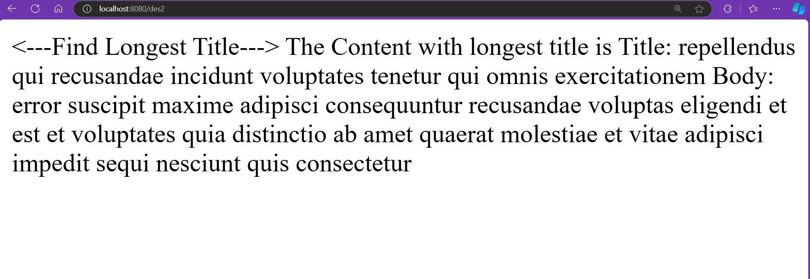
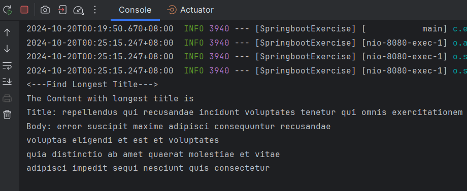
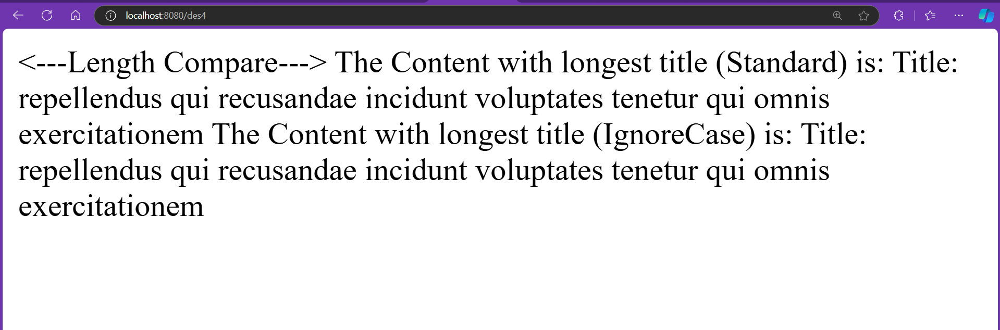
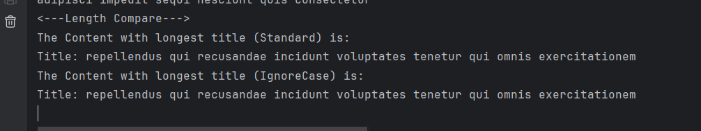

# SpringRestJson

This project mainly serves the purpose of familiarizing Springboot while implementing Rest API to retrive json post, and then play around with the json post

## Prerequisites

Before you begin, ensure you have met the following requirements:

- Java 17 or later
- Maven (or Gradle) installed on your machine
- IntelliJ IDEA (recommended for ease of use, not compulsory)

## Getting Started

Follow these steps to build and run the application:

### 1. Clone the Repository

Clone this repository to your local machine at you desired directory using the following command:

```bash
git clone https://github.com/Kitsune1797/SpringRestJson.git
```

### 2. Navigate to the Project Directory
After cloning is completed, navigate your local terminal to the project folder with 'cd'

Example:
```bash
cd SpringRestJson
```

### 3. Build the Project
If you are using Maven, run the following command to build the project:

```bash
mvn clean install
```

For Gradle, use:
```bash
./gradlew build
```

### 4. Run the Application
Now you built the project, time to run it (to make sure things go smoothly, remember to free up port 8080)

- **Option A**: Using IntelliJ
  Open the project in IntelliJ IDEA.

  Locate the main application file (usually annotated with @SpringBootApplication).

  Run the application by clicking the green run button or right-clicking the file and selecting "Run".


- **Option B**: Using the Command Line
  
  You can also run the application directly from the command line after building it:
```bash
java -jar target/SpringbootExercise-0.0.1-SNAPSHOT.jar
```
### 5. Access the Application
Once the application is running, open your web browser and navigate to the url below (basically navigating from des1 to des4):

The result can be viewed from both IDE and webpage, but IDE can display the result in a more oriented way.

- **Task 1- Spring Boot REST API**: Develops a REST API that connects to the JSONPlaceholder API to retrieve a list of posts.
  
  To access it, go to your web and type in following url:
  ```bash
  http://localhost:8080/des1
  ```
  Screenshot of Task 1 result
  


- **Task 2- Find Longest Title**: Implements logic to identify and display the title and body of the post with the longest title in the console.
  
  To access it, go to your web and type in following url:
  ```bash
  http://localhost:8080/des2
  ```
  Screenshot of Task 2 result in Web View
  
  
  Screenshot of Task 2 result in Console View
  


- **Task 3- JSON Response Format**: Enhances the JSON response of all posts by adding a new field, titleLength, which indicates the length of each post's title.
  
  To access it, go to your web and type in following url:
  ```bash
  http://localhost:8080/des3
  ```
  Screenshot of Task 3 result (Compare with Task 1 result, you will notice a new field):
  

- **Task 4- Polymorphism Implementation**: Utilizes Abstract Class and Polymorphism to perform title comparison methods when identifying the longest title.
  
  To access it, go to your web and type in following url:
  ```bash
  http://localhost:8080/des4
  ```
  Screenshot of Task 4 result in Web View
  
  
  Screenshot of Task 4 result in Console View
  

## Unit Testing
Below is a screenshot of the application's Unit Testing in action, Unit testing is done on every implemented task:

Unit Testing Performed:

Test 1
- Test to see if REST API call is successful
- Test to see if retrieval of custom local json from REST API

Test 2
- Test if program works as intended for only a single content in a json
- Test if program works as intended for multiple content in a json
- Test if program works as intended if there are no content in a json

Test 3
- Test if length calculation works
- Test if length calculation works if the title is empty
- Test if length calculation works if the title is full of special character

Test 4
- (StandardComparator) Test if comparator returns correct comparison for title with different length (true/false each 1 test)
- (IgnoreCaseComparator) Test if comparator returns correct comparison for title with different length (true/false each 1 test)
- (StandardComparator) Test if comparator returns false for title with same length
- (IgnoreCaseComparator) Test if comparator returns false for title with same length

Unit Testing Result:


